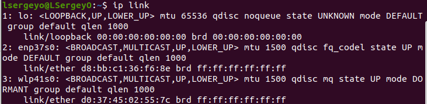
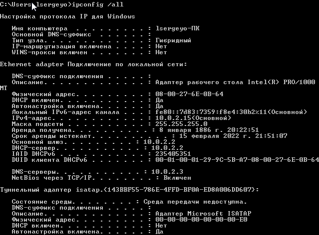
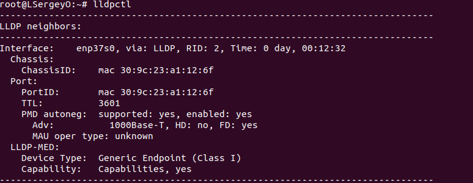

# devops-netology_3.7  
1. Linux:  
  
Windows: 
  

2. LLDP  
apt install lldpd  
  

3. VLAN  
apt install vlan  

root@LSergeyO:~# vim /etc/network/interfaces  

auto enp37s0.1001  
iface enp37s0.1001 inet static  
        address 192.168.1.200  
        netmask 255.255.255.0  
        vlan_raw_device enp37s0  
4. LAG: статический и динамический (LACP протокол)  
apt install ifenslave   

vim /etc/network/interfaces  

auto bond0  
iface bond0 inet static  
    address 192.168.1.210  
    netmask 255.255.255.0  
    network 192.168.1.210  
    gateway 192.168.1.1  
    bond-slaves eth0 eth1  
    bond-mode active-backup  
    bond-miimon 100  
    bond-downdelay 200  
    bond-updelay 200   
5. 8 ip адресов (0 - сеть, 1-7 host, 8 - broadcast)  
32 - подсети  
10.10.10.0/29  
10.10.10.8/29  
10.10.10.16/29  
6. 100.64.0.0/26  
7. Linux and Windows:  
arp -a (arp таблица)  
arp -d 192.168.0.1 (удалить определенную запись)  
arp -d (очистка кэш в Windows)  
sudo ip -s -s neigh flush all (очистка кэш в Linux)  

